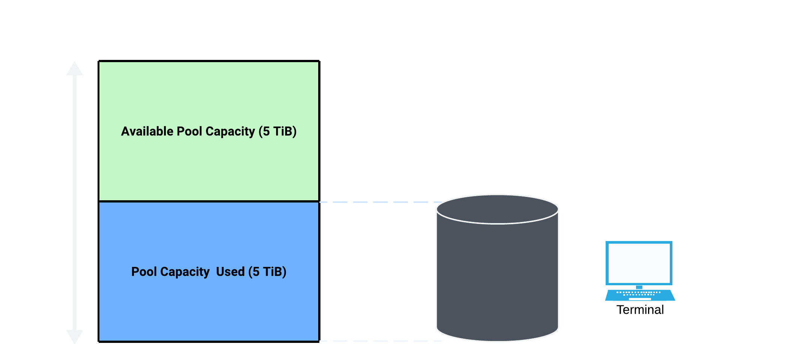

## Hyperdisk Pool

Hyperdisk Storage Pools are pre-purchased bundles of capacity, throughput, and IOPS for Compute Engine. You can create and manage disks within these pools, allocating resources to applications as needed. This centralized management simplifies capacity planning, reduces costs, and streamlines operations by consolidating hundreds of disks into a single pool.

## How it works?

Hyperdisk Storage Pools let you create a pool with the total capacity and performance your workloads need, then create disks within it to attach to VMs. These disks can be created with larger sizes or performance limits than initially needed, simplifying planning and allowing for future growth. If workloads grow, you can increase the pool's provisioned capacity and performance, letting individual disks use more resources up to their defined limits. This consolidates disk management and reduces costs. However, if an Advanced capacity pool reaches full utilization, writes to all disks fail until space is freed. Active monitoring and understanding workload behavior during out-of-space errors is crucial. In Advanced performance pools, auto-grow helps prevent performance issues by increasing available IOPS if contention is detected.

## Types of Pools

### Standard Capacity Storage Pools

Standard capacity storage pools allow you to add disks until the total provisioned capacity of all disks reaches the pool's limit. Disks in these pools use capacity like regular disks.

### Standard Performance Storage Pools

Standard performance provisioning is ideal for workloads that can't tolerate performance limitations due to storage pool constraints or have correlated performance spikes. It doesn't support thin-provisioning, and disks don't share performance resources. The total performance of all disks can't exceed the pool's provisioned amount. When creating the pool, ensure enough performance for combined peak needs. Each disk's provisioned performance should cover its peak requirements. You can add disks until total provisioned IOPS reaches the pool's limit. In Balanced pools with Standard performance, the first 3,000 IOPS and 140 MiBps per disk (baseline) don't consume pool resources, only exceeding amounts do.

### Advanced Capacity Storage Pools

Advanced capacity storage pools offer thin-provisioning and data reduction, allowing you to provision more disk space than physically available. Disks in these pools consume capacity based on actual data written after reduction, enabling over-provisioning. The pool's used capacity is determined by written data, not provisioned disk space, and can exceed provisioned capacity by up to 500%.

### Advanced Performance Storage Pools

Advanced performance provisioning is ideal for workloads with varied peak usage times, allowing shared performance resources across disks. The pool dynamically allocates performance as needed, and only used amounts consume resources. Thin provisioning lets you allocate up to 500% more IOPS/throughput to disks than provisioned for the pool. In Balanced pools with Advanced performance, all disk operations consume resources. If aggregate disk performance reaches the pool's limit, contention occurs, potentially impacting performance. Compute Engine tries to automatically add performance during prolonged contention. Monitor pools to avoid running out of performance and understand workload behavior during contention.

## References

[Documentation-About Hyperdisk Storage Pools](https://cloud.google.com/compute/docs/disks/storage-pools)
