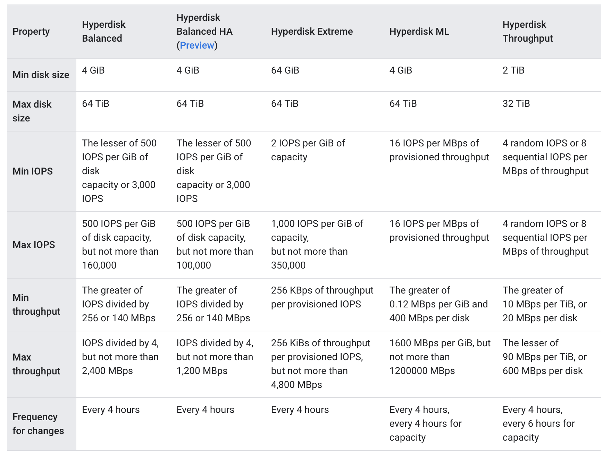

## Google Cloud Hyperdisk

Google Cloud Hyperdisk is a high-performance, scalable new-generation block storage service designed for demanding applications. It offers persistent storage that can be easily managed and scaled without the complexity and cost of traditional on-premises storage solutions. Hyperdisk volumes are independent of VMs, allowing for flexibility in attaching, detaching, and moving them between instances.

**Key Points**

- Hyperdisk volumes offer superior performance to Persistent Disk with dedicated IOPS and throughput.

- You can dynamically adjust performance and capacity to meet workload needs.

- A single disk can be attached to multiple VMs for read-only access.  (Hyperdisk-ML)

- Total capacity and the number of attachable volumes are subject to limits. Synchronous replication is available for high availability with Hyperdisk Balanced High Availability.

## Hyperdisk Types

### Balanced

Hyperdisk Balanced is recommended for most workloads that don't require the highest performance. For protection against zonal outages, **Hyperdisk Balanced High Availability** can be used for synchronous data replication across two zones.

### ML

Hyperdisk ML is ideal for machine learning workloads that require the highest throughput, leading to faster data loading times and reduced compute costs. It allows attaching a single volume to multiple VMs in read-only mode for large inference and training workloads.

### Extreme

Hyperdisk Extreme is suitable for performance-critical applications that need higher IOPS and throughput than Extreme Persistent Disk can offer, making it ideal for demanding workloads like high-performance databases.

### Throughput

Hyperdisk Throughput is a cost-effective solution for scale-out analytics workloads, cold storage, and data drives for budget-conscious applications. It offers flexible provisioning of capacity and throughput, improving efficiency and lowering total cost of ownership compared to Standard Persistent Disk volumes.

## Hyperdisk limits per disk

Refer [Hyperdisk limits per disk](https://cloud.google.com/compute/docs/disks/hyperdisks#limits-disk) for greater details

## Reference

[Documentation - About Google Cloud Hyperdisk](https://cloud.google.com/compute/docs/disks/hyperdisks)
